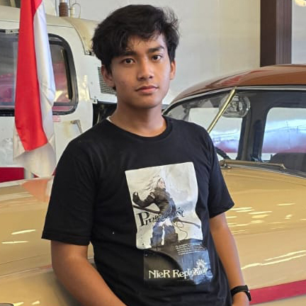
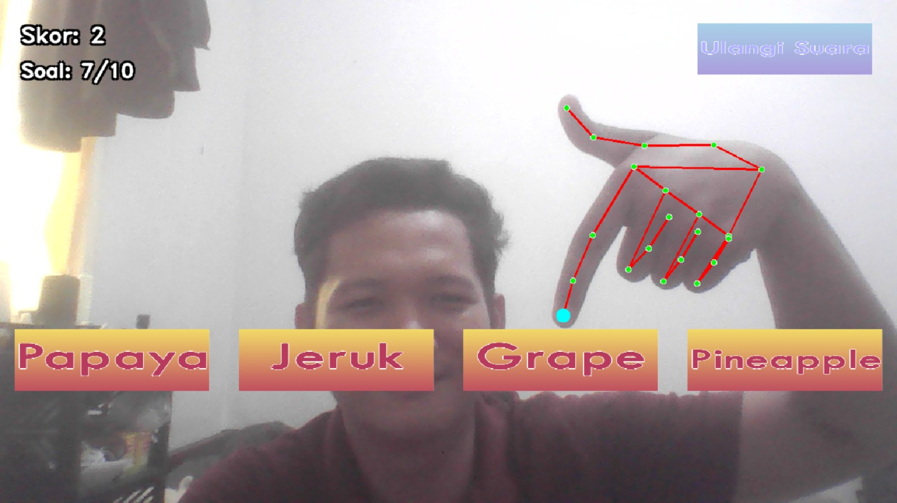
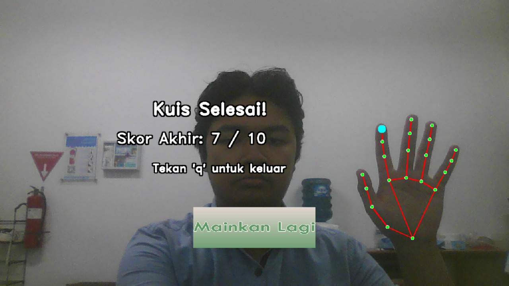

# 💡 GUESS THE WORD 💡 
### Created By Group: ✨ Shinning Shimmering Splendid ✨


## 📖 Daftar Isi
- [Deskripsi Proyek](#deskripsi-proyek)
- [Anggota Kelompok](#anggota-kelompok)
- [Teknologi Aplikasi](#teknologi-aplikasi)
- [Instruksi Instalasi](#instruksi-instalasi)
- [Logbook Mingguan](#logbook-mingguan)
- [Laporan](#laporan)
- [Demo Program](#demo-program)

## 📋 Deskripsi Proyek 
<i>Guess The Word</i> adalah filter kuis yang dimana user menebak kata dari audio. Nada dari audio tersebut akan dibuat seperti chipmunk dan audio akan menyebutkan satu kata. Kata yang disebutkan dalam Bahasa Indonesia dan/atau Bahasa inggris. Terdapat pilihan ganda yang mana user akan memilih jawaban yang sesuai dengan kata yang disebutkan oleh audio. User akan memilih dengan cara menunjuk atau mengarahkan jari ke jawaban yang dipilih. Kuis ini terdapat 3 kategori tebak-tebakan. Selain itu, jawaban yang benar akan mendapatkan poin dan jawaban yang salah tidak dapat poin. Poin akan ditotalkan diakhir kuis.

Filter akan:
1. Mendeteksi jari tangan dengan kamera dan interaksinya terhadap komponen lain dalam sistem.
2. Memutar suara berdasarkan kategori dengan sudah dinaikan <i>pitch</i>-nya sehingga menjadi tantangan dalam menebak.
3. Menampilkan pilihan-pilihan untuk menjawab dari apa yang disebutkan oleh suara.
4. Memunculkan indikasi jawaban benar atau salah dari suara yang muncul setelah menjawab, seperti "Ting" jika benar dan "Tot" jika salah.
5. Menampilkan skor dari jawaban yang sudah dijawab dan bertambah jika jawaban benar kemudian menampilkan skor diakhir game.

Filter ini cocok untuk melatih pendengaran dan pengucapan terhadap suatu kosakata, sehingga menambah gudang kosakata. 

## 📋 Anggota Kelompok
<table>
  <tr>
    <td align="center">
      <br/>
      <a href="https://github.com/earldev4">Deva Ahmad</a><br/>
      <b>122140015</b>
    </td>
    <td align="center">
      <br/>
      <a href="https://github.com/FARIS122140021">Faris Pratama</a><br/>
      <b>122140021</b>
    </td>
    <td align="center">
      <br/>
      <a href="https://github.com/ArkanHariz">Arkan Hariz Chandrawinata Liem</a><br/>
      <b>122140038</b>
    </td>
  </tr>
</table>

## 📋 Teknologi Aplikasi
<table>
  <tr>
    <th>Name</th>
    <th>Description</th>
  </tr>
  <tr>
    <td><b>Python</b></td>
    <td>Bahasa pemrograman utama yang digunakan dalam pengembangan aplikasi.</td>
  </tr>
  <tr>
    <td><b>gTTS</b></td>
    <td>Library untuk mengubah teks menjadi suara menggunakan layanan text-to-speech Google. Output biasanya berupa file audio seperti.</td>
  </tr>
  <tr>
    <td><b>pydub</b></td>
    <td>Library untuk memanipulasi audio, seperti memotong, menggabungkan, mengubah volume, format audio, konversi .mp3 ke .wav, dan lain-lain.</td>
  </tr>
  <tr>
    <td><b>OpenCV (opencv-python / cv2)</b></td>
    <td>Library untuk pengolahan gambar dan video, seperti deteksi objek, face detection, filtering, drawing, membaca/menyimpan file video, dan pengolahan piksel.</td>
  </tr>
  <tr>
    <td><b>MediaPipe</b></td>
    <td>Library untuk computer vision dan machine learning real-time, seperti deteksi tangan, pose tubuh, wajah, gesture tracking, face mesh, dan lain-lain.</td>
  </tr>
  <tr>
    <td><b>Librosa</b></td>
    <td>Library untuk analisis dan pemrosesan audio dan musik, seperti menghitung spektrogram, MFCC, tempo, pitch, waveform, dan fitur audio lainnya untuk machine learning atau DSP.</td>
  </tr>
  <tr>
    <td><b>SoundFile</b></td>
    <td>Library untuk membaca dan menulis berbagai format file audio (WAV, FLAC, OGG, AIFF) dan bekerja bersama dengan NumPy untuk mengakses data audio dalam bentuk array.</td>
  </tr>
  <tr>
    <td><b>NumPy</b></td>
    <td>Library untuk komputasi numerik berbasis array. Digunakan untuk operasi matematika cepat, manipulasi data berbentuk matriks, dan banyak dipakai sebagai basis data pada pengolahan audio/gambar.</td>
  </tr>
</table>

## 📋 Instruksi Instalasi
1. Buat virtual environtment menggunakan <i>venv</i>
Pada terminal Code Editor, masukan perintah berikut untuk membuat environment:
```
uv venv --python=python3.11
```
Catatan: Gunakan Python versi 3.11 kebawah karena library Mediapipe hanya support versi tersebut.
Setelah itu akan muncul folder <i>.venv</i>, masuk ke folder dengan perintah <i>cd .venv</i>

2. Clone repositori
Pada terminal, setelah masuk ke folder <i>.venv</i>, salin link dari repositori ini dan klon ke direktori lokal dengan perintah:
```
git clone git@github.com:earldev4/uas_teknomulmed_shiningshimmeringsplendid.git
```
Setelah itu akan muncul folder dengan nama seperti nama repositori ini, masuk ke folder dengan perintah <i>cd</i>.

3. Aktivasi Environment
Selanjutnya, pada terminal lakukan aktivasi environment dengan perintah berikut:

<ul>
  <li>Linux/MacOS</li>
  
```
source .venv\bin\activate
```
  <li>Windows</li>
  
```
.venv\Scripts\activate
```
</ul>

4. Instal semua dependensi yang diperlukan
Lakukan instalasi dependensi dari file requirements.txt pada terminal dengan perintah berikut:
```
pip install -r requirements.txt
```

5. Jalankan Program
Langkah terakhir yaitu menjalankan filter pada terminal dengan perintah berikut:
```
python main.py
```

## 📋 Petunjuk Bermain
<ol>
  <li>Jalankan program dan pastikan webcam aktif</li>
  <li>Akan muncul tulisan "Guess The World" dan tombol "Play", tekan tombol "Play" untuk memulai permainan</li>
  <li>Kemudian, pilih kategori yang akan anda mainkan dari ketiga kategori yaitu Hewan, Buah, dan Kendaraan</li>
  <li>Setelah permainan dimulai, telapak tangan Anda akan terdeteksi oleh filter dan filter akan menampilkan pilihan jawaban serta tombol untuk mengulang audio. Akan ada jeda 2 detik sebelum audio diputar</li>
  <li>Jawab soal dengan menunjukan jari ke kotak jawaban, jawaban yang benar akan memunculkan suara "TING" dan jawaban yang salah akan memunculkan suara "TOT", paham lah ya, yakan</li>
  <li>PERLU DIKETAHUI BAHWA kesempatan mendengarkan audio kembali hanya satu kali :P</li>
  <li>Nilai anda akan muncul pada skor di pojok kanan atas, nilai akan bertambah jika jawaban benar dan jika jawaban salah tidak terjadi penambahan skor, aman kok gk dikurangin</li>
  <li>TIDAK ADA batasan waktu pada setiap pertanyaan, dan tidak ada skip ke pertanyaan. Jadi kamu antara bisa menjawab benar, menjawab salah karena bingung, atau merenungi apa audio yang tadi diputar untuk sisa hidupmu :P </li>
  <li>Soal terdiri dari 10 pertanyaan acak dengan kombinasi 5 bahasa Indonesia dan 5 bahasa Inggris. Pastikan nilai TOEFL mu minimal diatas 500</li>
  <li>Setelah 10 pertanyaan selesai dijawab, skor akhir akan ditampilkan</li>
  <li>Tekan tombol "Mainkan lagi" untuk mengulang permainan, atau jika sudah puas atau bosan tekan tombol Q pada keyboard untuk mengakhiri filter</li>
</ol>

## 📋 Logbook Mingguan
<table>
  <thead>
    <tr>
      <th>Tanggal</th>
      <th>Kontributor</th>
      <th>Pekerjaan</th>
    </tr>
  </thead>
  <tbody>
    <tr>
      <td>27 Oktober 2025</td>
      <td align="center">Deva</td>
      <td>Mengajukan topik TA di Grup WA Kelas</td>
    </tr>
    <tr>
      <td rowspan="2">28 Oktober 2025</td>
      <td align="center">Deva</td>
      <td>Membuat Github Proyek</td>
    </tr>
    <tr>
      <td align="center">Arkan</td>
      <td>Membuat file audio_code.py, hand_masking.py, main.py dan membuat UI untuk filter</td>
    </tr>
    <tr>
      <td>11 November 2025</td>
      <td align="center">Arkan</td>
      <td>Membuat dan mengumpulkan data audio serta menambah file audio_processing.py</td>
    </tr>
    <tr>
      <td>22 November 2025</td>
      <td align="center">Arkan</td>
      <td>Memproses data audio dengan menaikkan pitch kemudian hasil audio yang di pitch disimpan ke folder pitch_audio</td>
    </tr>
    <tr>
      <td>23 November 2025</td>
      <td align="center">Arkan</td>
      <td>Membuat hand masking menggunakan mediapipe</td>
    </tr>
    <tr>
      <td>24 November 2025</td>
      <td align="center">Deva</td>
      <td>Membuat readme github, Mengubah kode hand masking, Membuat button</td>
    </tr>
    <tr>
      <td rowspan="2">26 November 2025</td>
      <td align="center">Deva</td>
      <td>Membuat laporan proyek dan memperbarui readme</td>
    </tr>
    <tr>
      <td align="center">Faris</td>
      <td>Membuat laporan proyek akhir, Membuat logbook kegiatan proyek akhir, Update code game state structure visualisasi tangan dengan landmark</td>
    </tr>
    <tr>
      <td>27 November 2025</td>
      <td align="center">Faris</td>
      <td>Update sistem tombol interaktif dan transisi MENU ke CATEGORY, Update tiga tombol kategori dengan navigasi dan penyimpanan pilihan, update data kata; audio Pygame; dan pemutaran audio soal, update opsi jawaban, cek benar/salah, skor, dan soal baru, update feedback visual, timer, dukungan PNG, dan image overlay</td>
    </tr>
    <tr>
      <td rowspan="2">28 November 2025</td>
      <td align="center">Faris</td>
      <td>Update final 10 kata/kategori, tombol BACK; RESET SKOR; dan kontrol audio, Membuat demo program</td>
    </tr>
    <tr>
      <td align="center">Deva</td>
      <td>Rename audio, membangun code di file main.py</td>
    </tr>
    <tr>
      <td>29 November 2025</td>
      <td align="center">Deva</td>
      <td>Membuat edek button ketika ditekan</td>
    </tr>
    <tr>
      <td>30 November 2025</td>
      <td align="center">Deva</td>
      <td>Split File dan pembagian ke beberapa modul</td>
    </tr>
    <tr>
      <td>1 Desember 2025</td>
      <td align="center">Deva</td>
      <td>Melanjutkan laporan proyek, Melanjutkan readme repository</td>
    </tr>
    <tr>
      <td>2 Desember 2025</td>
      <td align="center">Arkan</td>
      <td>Update readme repository</td>
    </tr>
  </tbody>
</table>

## 📋 Laporan
Laporan akhir proyek dapat diakses melalui:
(link ke laporan akhir)

## 📋 Demo Program
<br/>
<br/>
<br/>
